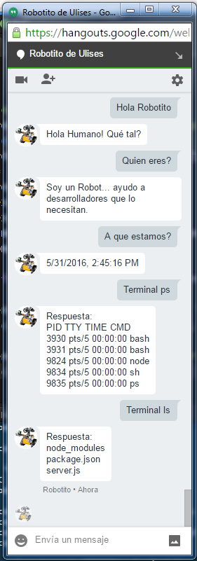

# Nodejs-hangouts-robot
Robot de chat para Google hangouts desarrollado con Node.js. Permite el uso de la Terminal/Consola, entre otras cosas



### IMPORTANTE!

Crea una cuenta de Google separada para el robot. 
Una vez lo hayas hecho, pincha en [este link](https://www.google.com/settings/security/lesssecureapps) desde esa cuenta para autorizar el uso de aplicaciones menos seguras.

### Configuración

**Previo**
- Es necesario que ambos usuarios se acepten via Google Hangouts. Es el primer paso para comunicarse y una manera efectiva de filtrar usuarios.
- Debes tener [Node y NPM](https://nodejs.org/en/) instalados en la máquina.

**Config.js**
Toda la configuración se realizará desde el archivo *config.js*

- Primer paso es poner la contraseña y usuario de nuestro robot aquí. Igual que si entraras en el email
```
botEmail: "USER@gmail.com",
botPassword: "PASS"
```
- Instalamos las dependencias y ejecutamos 
```
npm install && node robot
```
- Preguntamos al robot *Quien soy?* en el chat y respondera con algo parecido a esto
```
loremloremymaslorem1123@public.talk.google.com/lorem_lorem_123456789
```
- Paramos la ejecucción de Node en la terminal con `Ctrl+C` dos veces.
- Rellenamos los datos que faltan en la configuración partiendo de la respuesta de antes
```
usuarioId: "loremloremymaslorem1123",
usuarioAutorizado: "loremloremymaslorem1123@public.talk.google.com",
```
- Lanzamos de nuevo el robot `node robot` y nos saludará automaticamente por el chat *Hola de nuevo, Jefe!*.


### Eventos Automáticos
- Las siguientes comunicaciones solo son relevantes a *config.usuarioAutorizado*, que será quien recibirá los mensajes.

- Al arrancar la aplicación de Node... el robot saluda *Hola de nuevo, Jefe!*
- Al cerrar la aplicación vía Ctrl+C... el robot se despide *Me piro! Ya no me quieres como antes...*
- Al terminarse de manera natural la ejecucción... el robot se despide *Me piro! Vaciones por fín!*
- Al tener un error inesperado y cerrarse... el robot se despide *Me piro! Cierre inesperado...*

### Preguntas y respuestas posibles:

Nota:
Los acentos e interrogantes del inicio no se han incluido para agilizar la comunicación por chat. 
Si deseas cambiarlo, solo tienes que reescribir las cadenas de texto en las lineas correspondientes

**Por defecto...**
- Si nuestro mensaje no cumple al menos uno de los siguientes casos, por defecto el robot nos respondera *No te entiendo... Explicate mejor, Humano!*

**Hola (Expresión regular)**
- Se dispara cuando nuestro mensaje empieza con la palabra Hola/hola.
- Responde con *Hola Humano! Qué tal?*

**Quien eres?**
- Responde con *Soy un Robot... ayudo a desarrolladores que lo necesitan.*

**Que version eres?**
- Responde con la versión del del package.json
 
**Quien es tu creador?**
- Responde con la información del autor/es del package.json

**Quien soy?**
- Responde con tu ID en formato *lorelipsum1234lorem12@public.talk.google.com* que es lo necesario para configurar el *usuarioAutorizado* en *config.js*

**Timestamp**
- Responde con la fecha y la hora en formato *MM/DD/YYYY, HH:MM:SS AM/PM*


**Terminal**
- Se dispara cuando nuestro mensaje empieza con la palabra Terminal/terminal.
- Valida que el ID del usuario que nos pide este comando es realmente el mismo que esta almacenado en *config.usuarioId*.
- Si se intentan lanzar comandos de terminal por parte de usuarios no autorizados, el propio robot avisa al *config.usuarioAutorizado* con los datos del usuario y comando deseado
- Una vez confirmada la autenticidad, lanza el código por la consola que es el texto despues de *"Terminal "*
- Responde con *Respuesta: * o con "Error: " y el texto que saldría por la consola en ambos casos.
- Se utilizan [procesos hijo](https://nodejs.org/api/child_process.html), lo que permite mantener funcionando el [hilo principal](http://stackoverflow.com/questions/17959663/why-is-node-js-single-threaded) aunque ocurrar errores.

**Terminal: Ejemplos**
- Ejemplo simple

Usuario: `Terminal ps`
Robot:
```
Respuesta: 
PID TTY TIME CMD
435 pts/0 00:00:00 bash
449 pts/0 00:00:00 bash
2652 pts/0 00:00:00 node
2711 pts/0 00:00:00 sh
2712 pts/0 00:00:00 ps
```

- Concatenando comandos:

Usuario: `Terminal node -v && npm -v`
Robot:
```
Respuesta: 
v4.4.5 
2.15.5
```

- En caso de comandos erroneos

Usuario: `Terminal me lo invento`
Robot:
```
Error: 
Error: Command failed: /bin/sh -c me lo invento
/bin/sh: 1: me: not found
```         

- En caso de peticiones por usuarios distintos a *config.usuarioAutorizado*

Usuario Normal: `Terminal echo Hacked!`
Robot a *usuario Normal*:
```
Buen intento.. pero con esas zapatillas no ejecutas comandos!
```
Robot a *config.usuarioAutorizado*:
``` 
Intento de ejecutar código por parte de loremloremymaslorem1123@public.talk.google.com/lorem_lorem_123456789
Ha solicitado Terminal echo Hacked!
```

### Pendiente

- [ ] Controlar un Arduino desde el Robot
